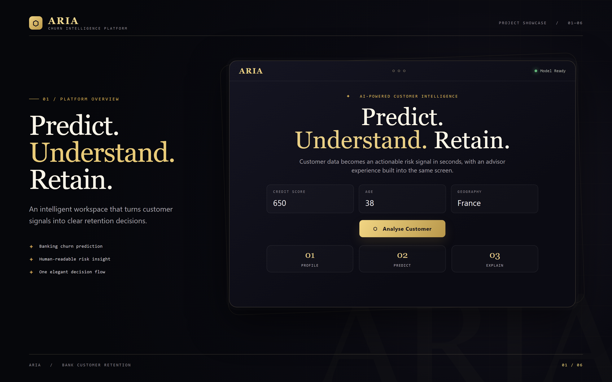
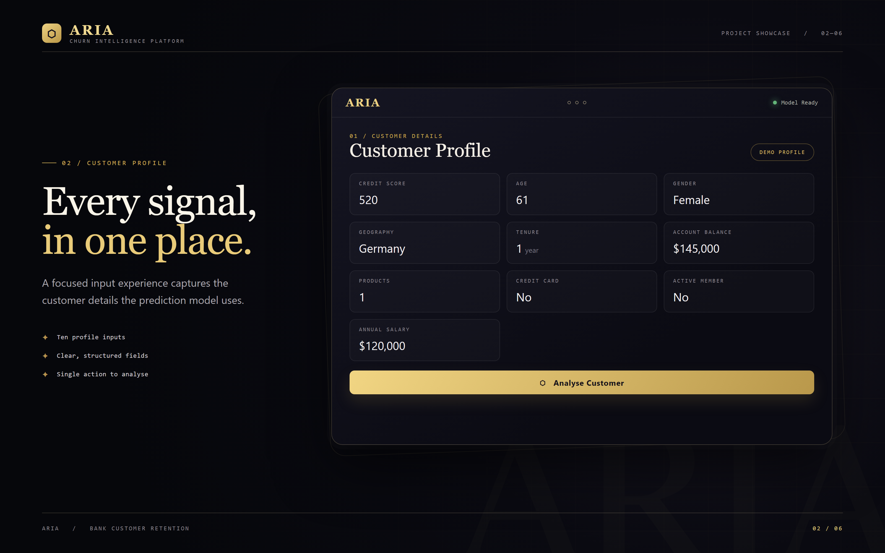
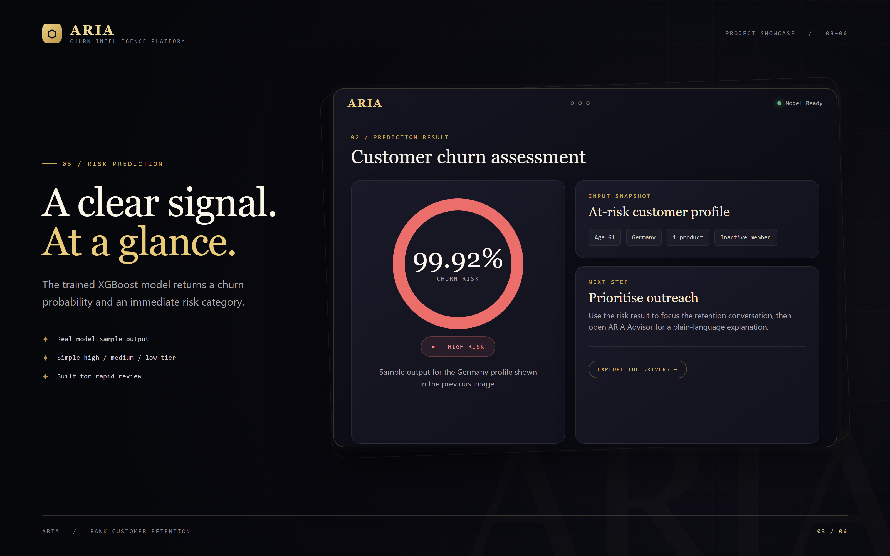
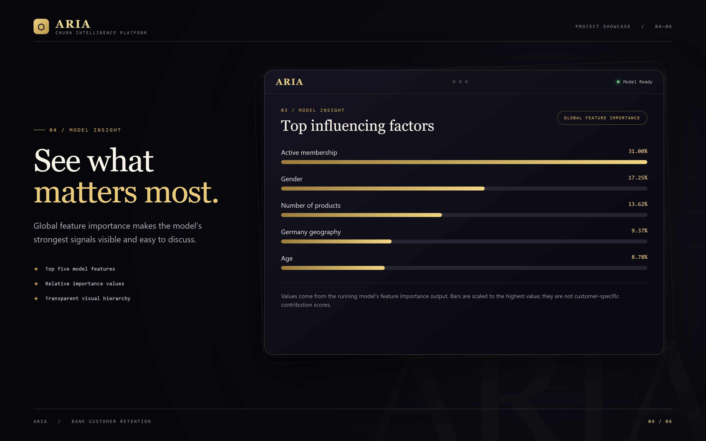
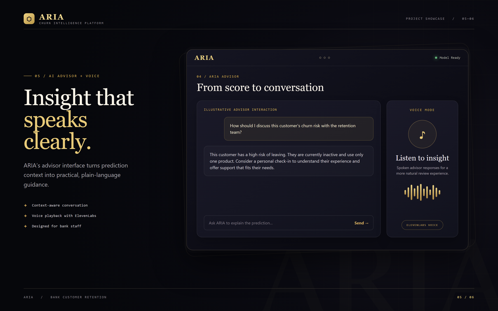
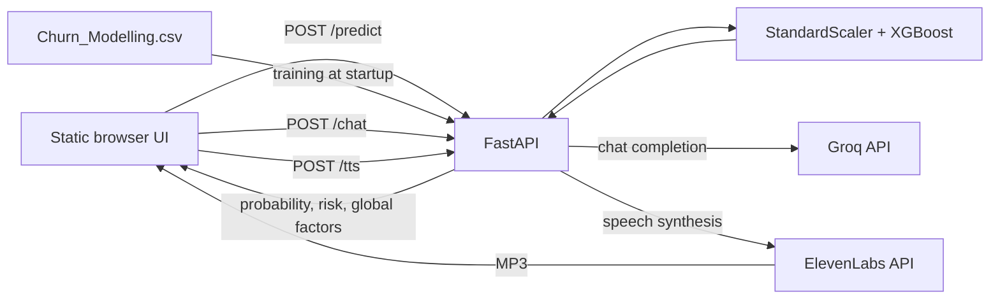

# ARIA — Bank Churn Intelligence Platform

An interactive prototype for estimating bank customer churn and helping staff discuss the result. A FastAPI service trains an XGBoost classifier from the included dataset; a static web interface collects customer details, displays the prediction, and offers optional AI-generated text and speech.



*ARIA interface overview. Portfolio visuals are styled representations of the application; sample customer details are for demonstration.*

## Contents

- [Project showcase](#project-showcase)
- [Capabilities](#capabilities)
- [Architecture and workflow](#architecture-and-workflow)
- [Model approach](#model-approach)
- [Technology stack](#technology-stack)
- [Repository structure](#repository-structure)
- [Getting started](#getting-started)
- [API reference](#api-reference)
- [Development and contribution](#development-and-contribution)
- [Current scope](#current-scope)

## Project showcase

| Customer profile | Churn assessment |
|:---:|:---:|
| [](portfolio_images/02-customer-profile.png) | [](portfolio_images/03-risk-prediction.png) |
| The form captures the inputs used by the classifier. | A real sample response from the running model: **99.92%** churn probability for the profile at left. |

| Model feature importance | AI advisor and voice |
|:---:|:---:|
| [](portfolio_images/04-feature-importance.png) | [](portfolio_images/05-ai-advisor-voice.png) |
| The five highest global feature-importance values returned by the model. These are **not** customer-specific attribution scores. | The interface can request a plain-language explanation and synthesize it as speech. The conversation shown is illustrative. |

## Capabilities

| Area | Implemented behavior |
|---|---|
| Prediction | Accepts customer attributes and returns a churn probability, binary prediction, and low/medium/high risk label. |
| Model visibility | Returns the five largest **global** XGBoost feature-importance values. |
| Advisor | Sends the prediction context and a staff question to Groq's `llama-3.3-70b-versatile` model. Requires `GROQ_API_KEY`. |
| Speech | Sends advisor text to ElevenLabs and streams MP3 audio. Requires `ELEVENLABS_API_KEY`. |
| Interface | Provides a customer form, risk visualization, factor bars, chat panel, and audio playback. |
| API documentation | Exposes FastAPI's interactive OpenAPI UI at `/docs`. |

Prediction works without external API keys. The web interface requests an advisor explanation after each prediction; chat and speech need their respective keys and network access.

## Architecture and workflow



1. The backend starts from the `backend/` directory, reads the included CSV, trains the model, and saves `churn_model.pkl` and `scaler.pkl` in that directory.
2. The browser collects customer values and calls `POST /predict`. The backend applies the fitted scaler and returns a probability, class, risk tier, and global feature ranking.
3. The browser renders the result and automatically calls `POST /chat` for an explanation. Staff can ask follow-up questions in the same panel.
4. When chat returns text, the browser calls `POST /tts` and plays the generated audio if ElevenLabs is configured.

The frontend calls `http://127.0.0.1:8000` directly. The API permits cross-origin requests, so the static page can be served separately during local development.

## Model approach

The training function in [`backend/main.py`](backend/main.py) runs on API startup:

1. Load the 10,000-row dataset and remove `RowNumber`, `CustomerId`, and `Surname`.
2. Encode gender as a binary field and one-hot encode geography with one category omitted.
3. Apply SMOTE, then make a stratified train/test split.
4. Fit `StandardScaler` on the training features and train `XGBClassifier`.
5. Keep the trained model and scaler in memory and write pickle artifacts locally.

`/predict` reports the churn probability as a percentage. Risk is **LOW** at or below 35%, **MEDIUM** above 35% through 65%, and **HIGH** above 65%. The returned factor values come from `model.feature_importances_`; they describe the model overall, not why one customer received a particular score.

**Evaluation note:** The repository does not currently publish a reproducible held-out metric report. SMOTE is applied before the train/test split in the current code, so the split should not be treated as an independent performance estimate. No accuracy or AUC claim is made here.

## Technology stack

| Layer | Technology |
|---|---|
| Frontend | HTML, CSS, vanilla JavaScript |
| API | Python, FastAPI, Uvicorn, Pydantic, HTTPX |
| Data and model | Pandas, NumPy, scikit-learn, imbalanced-learn, XGBoost |
| Optional integrations | Groq chat completions, ElevenLabs text-to-speech |

## Repository structure

```text
bank-churn-intelligence-platform/
├── backend/
│   ├── main.py                 # API, training, prediction, chat, and speech
│   ├── requirements.txt        # Declared Python dependencies
│   └── Churn_Modelling.csv     # Included training data
├── frontend/
│   └── index.html              # Static browser application
├── portfolio_images/          # README visuals
├── Scripts/                   # Checked-in environment scripts; not needed for setup
└── README.md
```

## Getting started

### Prerequisites

- Python 3.10 or newer
- Optional: Groq and ElevenLabs API keys for chat and speech

### 1. Clone and create an environment

```bash
git clone https://github.com/vinayak533/bank-churn-intelligence-platform.git
cd bank-churn-intelligence-platform
python -m venv .venv
```

Activate it with `source .venv/bin/activate` on macOS/Linux or `.venv\Scripts\Activate.ps1` in PowerShell.

### 2. Install dependencies

```bash
python -m pip install -r backend/requirements.txt python-dotenv
```

`backend/main.py` imports `python-dotenv`, but the current requirements file does not list it. The extra package above is required until that manifest is updated.

### 3. Configure optional integrations

Set `GROQ_API_KEY` for advisor responses and `ELEVENLABS_API_KEY` for speech. For example, in macOS/Linux shells:

```bash
export GROQ_API_KEY="your-groq-key"
export ELEVENLABS_API_KEY="your-elevenlabs-key"
```

In PowerShell:

```powershell
$env:GROQ_API_KEY = "your-groq-key"
$env:ELEVENLABS_API_KEY = "your-elevenlabs-key"
```

Keep keys out of commits. Prediction and `/health` work without them.

### 4. Run the backend

From the repository root:

```bash
cd backend
python -m uvicorn main:app --host 127.0.0.1 --port 8000
```

Wait for model training to finish. Check `http://127.0.0.1:8000/health` for `"model_loaded": true`; API documentation is at `http://127.0.0.1:8000/docs`.

### 5. Run the frontend

In a second terminal, from the repository root:

```bash
cd frontend
python -m http.server 5500 --bind 127.0.0.1
```

Open `http://127.0.0.1:5500/`. If you are already in `backend/`, return to the repository root before running the frontend commands.

## API reference

| Method | Route | Purpose |
|---|---|---|
| `GET` | `/health` | Returns service status and whether a model is loaded. |
| `POST` | `/predict` | Accepts customer fields and returns prediction, probability, risk, factors, and the submitted data. |
| `POST` | `/chat` | Accepts `message` and `prediction_context`; returns an advisor reply. |
| `POST` | `/tts` | Accepts `text`; streams MPEG audio. |
| `GET` | `/docs` | Interactive OpenAPI documentation. |

`/predict` expects numeric fields: `CreditScore`, `Gender`, `Age`, `Tenure`, `Balance`, `NumOfProducts`, `HasCrCard`, `IsActiveMember`, `EstimatedSalary`, `Geography_Germany`, and `Geography_Spain`. `Gender` is `1` for male and `0` for female; both geography flags are `0` for France. The web form handles this encoding automatically.

## Development and contribution

- Start the API from `backend/`: its dataset and artifact paths are relative to the working directory.
- Use `/health`, `/docs`, and a sample `/predict` request as local smoke checks after changes.
- Keep credentials out of source control, and describe any model or API contract changes in a pull request.
- Automated tests and CI are not currently included in this repository. Contributions that add them are welcome.

## Current scope

This is an interactive project prototype. It retrains on every API startup, uses a fixed local API URL in the frontend, and has no deployment configuration or independent model evaluation report in the repository. The advisor and voice features also depend on external services. These boundaries are reflected here so the README can be used as an accurate implementation guide.

---

Maintained by [Vinayak K V](https://github.com/vinayak533).
