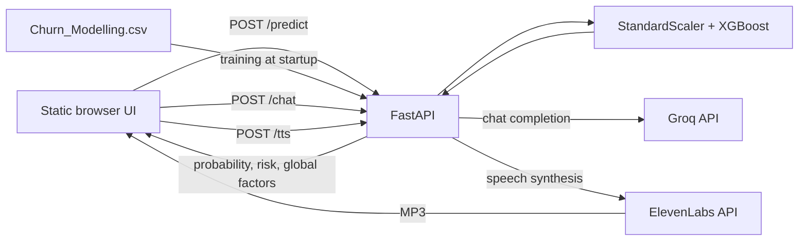

<div align="center">

<h1>ARIA — Bank Churn Intelligence Platform</h1>

<p>Bank churn assessment for bank staff: XGBoost risk scoring with optional AI explanations and speech.</p>

<p>
  
  
  
  
  
</p>


<p><em>Interface overview. Portfolio visuals are styled representations of the application; sample customer details are for demonstration.</em></p>

<p><a href="#-demo--screenshots">Demo</a> · <a href="#api-reference">Docs</a> · <a href="#-architecture">Architecture</a> · <a href="#-getting-started">Quickstart</a></p>

</div>

<details>
<summary>Table of contents</summary>

- [Problem and Solution](#-problem-and-solution)
- [Key Features](#-key-features)
- [Demo / Screenshots](#-demo--screenshots)
- [Architecture](#-architecture)
- [Tech Stack](#-tech-stack)
- [Engineering Highlights](#-engineering-highlights)
- [Getting Started](#-getting-started)
- [Project Structure](#-project-structure)
- [Roadmap](#-roadmap)
- [Author](#-author)

</details>

## 🎯 Problem and Solution

Bank staff need to turn customer attributes into a risk assessment they can discuss with a customer.
ARIA combines a customer form, churn probability, risk tier, and global model feature rankings in one interface.

Optional AI-generated text and speech help staff discuss the prediction and ask follow-up questions.
This is an interactive prototype; the repository does not publish an independent model evaluation report or deployment configuration.

## ✨ Key Features

- **Customer profile capture** — the form encodes customer attributes for the classifier, keeping API field mapping out of the staff workflow.
- **Churn assessment** — returns a probability, binary prediction, and low/medium/high risk label for a quick assessment of the submitted profile.
- **Model visibility** — displays the five largest global XGBoost feature-importance values to show which inputs the model uses most overall.
- **AI advisor** — sends prediction context and a staff question to Groq's `llama-3.3-70b-versatile` model for a plain-language response.
- **Voice playback** — sends advisor text to ElevenLabs and streams MP3 audio for listening within the interface.
- **Integrated browser workflow** — combines the customer form, risk visualization, factor bars, chat panel, and audio playback so staff can move from prediction to discussion.
- **API visibility** — exposes model readiness through `/health` and interactive OpenAPI documentation through `/docs` for integration and local inspection.

Prediction works without external API keys. The interface requests an advisor explanation after each prediction; chat and speech require their respective keys and network access.

| Customer profile | Churn assessment |
|:---:|:---:|
| <a href="portfolio_images/02-customer-profile.png"></a> | <a href="portfolio_images/03-risk-prediction.png"></a> |
| Inputs used by the classifier. | A real sample response from the running model: **99.92%** churn probability for the profile at left. |

## 📸 Demo / Screenshots

| Model feature importance | AI advisor and voice |
|:---:|:---:|
| <a href="portfolio_images/04-feature-importance.png"></a> | <a href="portfolio_images/05-ai-advisor-voice.png"></a> |
| Global importance values, **not customer-specific attribution scores**. | Plain-language explanation and speech controls; the conversation shown is illustrative. |

## 🏗️ Architecture



- **Separate UI and API:** the static frontend calls `http://127.0.0.1:8000` directly; permitted cross-origin requests allow it to be served separately during local development.
- **Startup training:** the backend reads the included CSV and retrains on every API startup; startup must finish before prediction is available.
- **Local model state:** the trained model and scaler stay in memory, with `churn_model.pkl` and `scaler.pkl` written in `backend/`; dataset and artifact paths depend on that working directory.
- **Automatic explanation:** after rendering a prediction, the browser calls `/chat`; staff can then ask follow-up questions in the same panel.
- **External speech service:** when chat returns text, the browser calls `/tts` and plays the audio if ElevenLabs is configured; advisor and voice availability depend on external services.

### Model approach

The training function in [`backend/main.py`](backend/main.py) runs on API startup:

1. Load the 10,000-row dataset and remove `RowNumber`, `CustomerId`, and `Surname`.
2. Encode gender as a binary field and one-hot encode geography with one category omitted.
3. Apply SMOTE, then make a stratified train/test split.
4. Fit `StandardScaler` on the training features and train `XGBClassifier`.
5. Keep the model and scaler in memory and write pickle artifacts locally.

`/predict` reports churn probability as a percentage: **LOW** at or below 35%, **MEDIUM** above 35% through 65%, and **HIGH** above 65%.
Factor values come from `model.feature_importances_`; they describe the model overall, not why one customer received a particular score.

**Evaluation boundary:** SMOTE is applied before the train/test split, so the split should not be treated as an independent performance estimate.
The repository does not publish a reproducible held-out metric report; no accuracy or AUC claim is made here.

## 🧰 Tech Stack

| Layer | Tools | Purpose |
|---|---|---|
| Frontend | HTML, CSS, vanilla JavaScript | Customer form, risk visualization, factor bars, chat, and audio playback. |
| Backend | Python, FastAPI, Uvicorn, Pydantic, HTTPX | API serving, request schemas, and external API calls. |
| AI-ML | XGBoost, scikit-learn, imbalanced-learn | Classification, scaling, stratified splitting, and SMOTE resampling. |
| AI-ML | Groq, ElevenLabs | Optional chat completions and text-to-speech. |
| Data | Pandas, NumPy, `Churn_Modelling.csv` | Tabular data preparation and the included training dataset. |

Declared dependency versions are in [`backend/requirements.txt`](backend/requirements.txt). Setup also installs `python-dotenv`, which the backend imports but the manifest does not list.

## ⚙️ Engineering Highlights

- **Class imbalance:** Problem → churn training uses imbalanced classes. Approach → SMOTE resampling followed by a stratified split. The resampling order remains an evaluation limitation described above.
- **Training and inference consistency:** Problem → prediction inputs need the fitted training transformation. Approach → retain the fitted scaler with the model and apply it before inference. Result → `/predict` returns probability, class, risk tier, and global factors.
- **Feature-importance interpretation:** Problem → a global ranking cannot explain an individual prediction. Approach → identify the returned factors as global model importance throughout the documentation.
- **Credential-dependent integrations:** Problem → chat and speech need separate external credentials. Approach → configure each integration with its own environment variable. Result → prediction and `/health` work without either key.

### API reference

| Method | Route | Purpose |
|---|---|---|
| `GET` | `/health` | Returns service status and whether a model is loaded. |
| `POST` | `/predict` | Accepts customer fields and returns prediction, probability, risk, factors, and the submitted data. |
| `POST` | `/chat` | Accepts `message` and `prediction_context`; returns an advisor reply. |
| `POST` | `/tts` | Accepts `text`; streams MPEG audio. |
| `GET` | `/docs` | Interactive OpenAPI documentation. |

`/predict` expects numeric fields: `CreditScore`, `Gender`, `Age`, `Tenure`, `Balance`, `NumOfProducts`, `HasCrCard`, `IsActiveMember`, `EstimatedSalary`, `Geography_Germany`, and `Geography_Spain`.
`Gender` is `1` for male and `0` for female; both geography flags are `0` for France. The web form handles this encoding automatically.

## 🚀 Getting Started

### Prerequisites and installation

- Python 3.10 or newer.
- Optional: Groq and ElevenLabs API keys for chat and speech.

Clone the repository and create an environment:

```bash
git clone https://github.com/vinayak533/bank-churn-intelligence-platform.git
cd bank-churn-intelligence-platform
python -m venv .venv
```

Activate on macOS/Linux:

```bash
source .venv/bin/activate
```

Or activate in PowerShell:

```powershell
.venv\Scripts\Activate.ps1
```

Install dependencies:

```bash
python -m pip install -r backend/requirements.txt python-dotenv
```

The extra `python-dotenv` package is required until the requirements manifest includes the backend's import.

### Configure optional integrations

Set these environment variables locally; keep credentials out of commits:

| Variable | Enables |
|---|---|
| `GROQ_API_KEY` | Advisor explanations and follow-up chat. |
| `ELEVENLABS_API_KEY` | Speech synthesis and audio playback. |

Prediction and `/health` work without these variables. Chat and speech also require network access.

### Run the backend and frontend

From the repository root, start the backend:

```bash
cd backend
python -m uvicorn main:app --host 127.0.0.1 --port 8000
```

Wait for training to finish. Check [service health](http://127.0.0.1:8000/health) for `"model_loaded": true`; open [interactive API docs](http://127.0.0.1:8000/docs) to inspect the routes.

In a second terminal, from the repository root, serve the frontend:

```bash
cd frontend
python -m http.server 5500 --bind 127.0.0.1
```

Open [the local interface](http://127.0.0.1:5500/). If you are already in `backend/`, return to the repository root before running the frontend commands.

For local smoke checks after changes, use `/health`, `/docs`, and a sample `/predict` request. Describe model or API contract changes in a pull request and keep credentials out of source control.

## 📂 Project Structure

```text
bank-churn-intelligence-platform/
├── backend/                    # API, training, prediction, chat, and speech
│   ├── main.py                 # Service implementation
│   ├── requirements.txt        # Declared Python dependencies
│   ├── Churn_Modelling.csv     # Included training data
│   ├── churn_model.pkl         # Locally written model artifact
│   └── scaler.pkl              # Locally written scaler artifact
├── frontend/                   # Static browser application
│   └── index.html              # Customer assessment interface
├── portfolio_images/           # README showcase visuals
├── Scripts/                    # Checked-in environment scripts; not needed for setup
└── README.md
```

## 🗺️ Roadmap

Next steps address the current prototype's documented limits; contributions are welcome.

- [x] Connect customer input, churn prediction, global feature rankings, advisor chat, and voice playback.
- [ ] Split before SMOTE and publish a reproducible held-out evaluation report.
- [ ] Add automated tests and CI; neither is currently included.
- [ ] Separate model training from API startup and make the fixed frontend API URL configurable for deployment.
- [ ] Add `python-dotenv` to the dependency manifest.

## 👤 Author

**Vinayak K V** · AI/ML Engineer at AMnova Technologies

[GitHub](https://github.com/vinayak533) · [LinkedIn](https://linkedin.com/in/vinayak-kv-ds) · [Email](mailto:vinayakkvjob@gmail.com)

Building production multi-agent AI systems. Open to technical discussions and collaboration.
